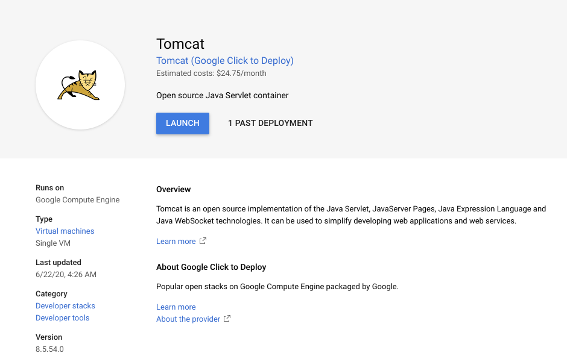

# Migrate VM to Contaier with Migrate for Anthos Getting Started

[Migrate for Anthos](https://cloud.devsite.corp.google.com/migrate/anthos/docs) allows you to generate a Container from Virtual Machine.

## Description

## Demo

### 0. Prepare Sample VM

## Features

- feature:1
- feature:2

## Requirement

## Usage

## Installation

## Licence

Released under the [MIT license](https://gist.githubusercontent.com/shinyay/56e54ee4c0e22db8211e05e70a63247e/raw/34c6fdd50d54aa8e23560c296424aeb61599aa71/LICENSE)

## Author

[shinyay](https://github.com/shinyay)
